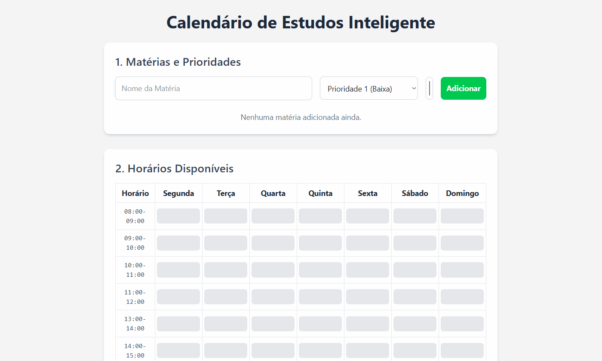

# 🧠 Smart Schedule

<p align="center">
  
</p>

**Smart Schedule** is an intelligent web application designed to help students automatically generate a balanced and personalized weekly study schedule.


## 🔍 Overview
This project is a full-stack web application that allows users to input their subjects, assign a priority (weight) to each, and select their available time slots throughout the week. The backend then processes this information to generate a proportional and visually organized study plan, which is displayed on the user interface.

> 💡 This project was built with a focus on learning Docker — using `Dockerfile`, `docker-compose.yml`, images, containers, and multi-stage builds — to create a portable and scalable development environment.

📚 Developed during the **Alura DevOps Immersion** program.

## 🚀 Features
🔹 **Subject Management** – Add, edit, or remove study subjects with full CRUD support.  
🔹 **Priority Weighting** – Assign weights to subjects to influence time distribution.  
🔹 **Color Coding** – Each subject has a custom color for better visual clarity.  
🔹 **Availability Grid** – Select your available study hours via an interactive weekly grid.  
🔹 **Auto Schedule Generation** – The backend algorithm smartly distributes time based on availability and priority.  
🔹 **Visual Timetable** – View your weekly study plan in a clean, color-coded format.  
🔹 **Dockerized Setup** – Easily run everything with Docker and Docker Compose.

## 🖼️ Demo
<p align="center">
  
</p>

## 📂 Project Structure
``` bash
smart-schedule/  
├── backend/                  # Flask Python Backend  
│   ├── venv/                 # Virtual environment (ignored)  
│   ├── app.py                # Main Flask application and API logic  
│   ├── Dockerfile            # Instructions to build the backend   image  
│   └── requirements.txt      # Python dependencies  
│  
├── frontend/                 # React TS Frontend  
│   ├── dist/                 # Production build output (ignored)  
│   ├── node_modules/         # Node.js packages (ignored)  
│   ├── public/               # Static assets  
│   ├── src/                  # React source code (components, pages, api)  
│   ├── Dockerfile            # Instructions to build the frontend image  
│   ├── package.json          # Project dependencies and scripts  
│   └── tailwind.config.js    # Tailwind CSS configuration  
│  
├── .dockerignore             # Specifies files to ignore in Docker build context  
├── .gitignore                # Specifies files to ignore for Git  
├── docker-compose.yml        # Defines and runs the multi-container application  
└── README.md                 # This file  
```
## 🛠️ Technologies Used  
### Frontend:  

-   
-   
-   
- React.ts
- Vite
- ESLint
- Other Dependecys

### Backend:
-   
- Flask
- Gunicorn
- Other Dependecys

### DevOps
-   
- Docker Compose 
-   
-   

## ⚙️ Setup and Running
You can run this project using Docker (recommended) or manually set up each service.

### 🐳 Using Docker (Recommended) 
Make sure you have Docker and Docker Compose installed on your machine.

#### Clone the repository:

``` bash
git clone https://github.com/TiagoSBittencourt/Smart-Schedule.git
cd smart-schedule
```

#### Run the application using Docker Compose:
``` bash
docker-compose up -d --build
```
The application will be available at:

- Frontend: http://localhost:3000

- Backend API: http://localhost:5000

### 🛠️ Manual Setup (Without Docker)

#### Backend
``` bash
cd backend
# Create and activate virtual environment (first time)
python -m venv venv
# On Windows: venv\Scripts\activate
# On macOS/Linux: source venv/bin/activate

# Install dependencies
pip install -r requirements.txt

# Run the server
python app.py
```
- The backend API will be running on http://127.0.0.1:5000.

#### Frontend
``` bash

cd frontend

## Install dependencies (first time)
npm install

## Start the development server
npm run dev
```
- The frontend will be available at http://localhost:5173.

## 📄 License
This project is licensed under the MIT License.